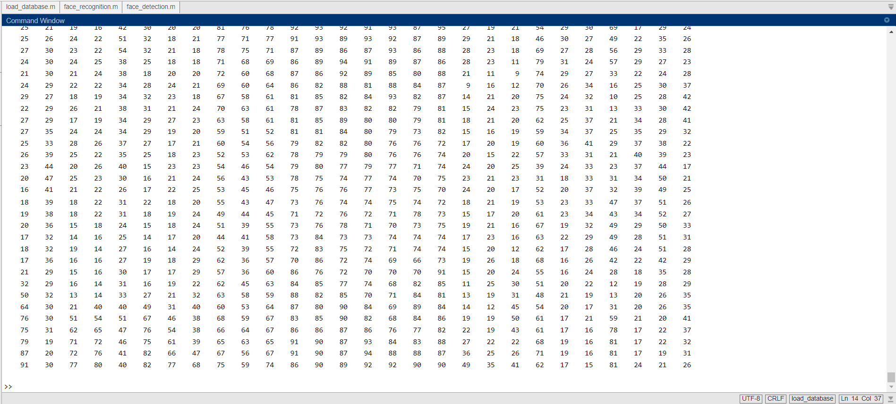
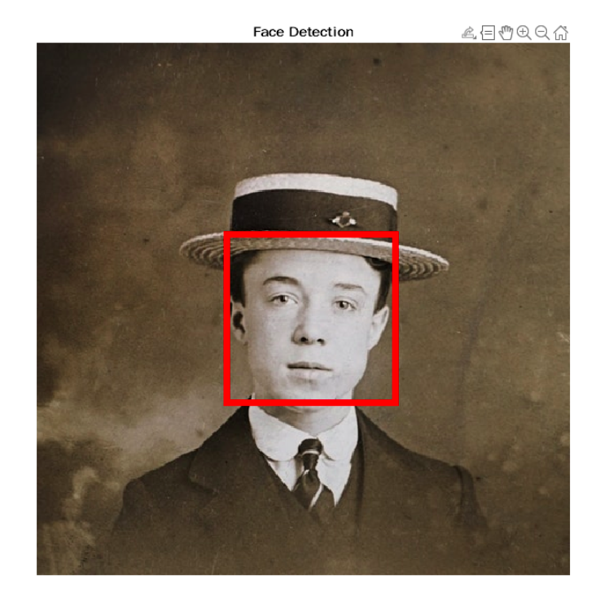
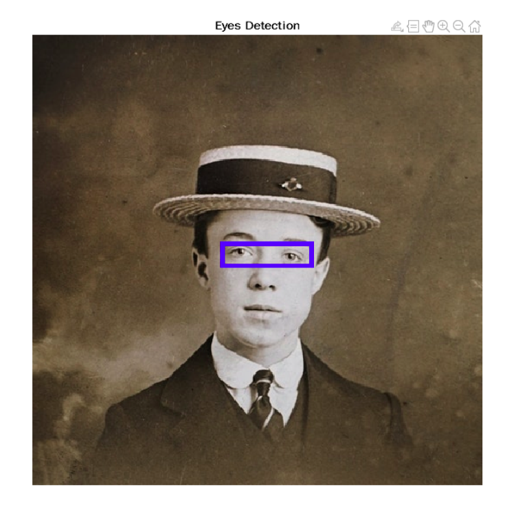
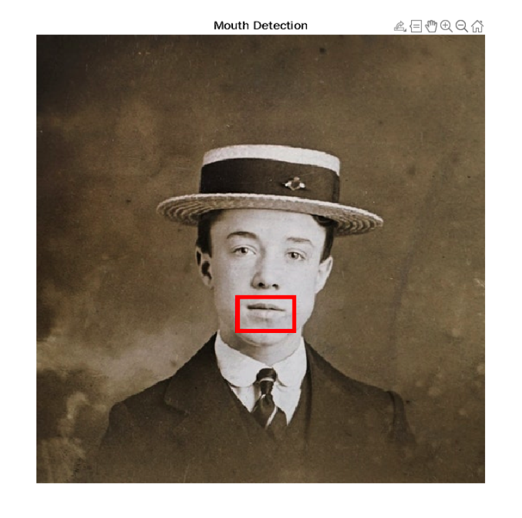
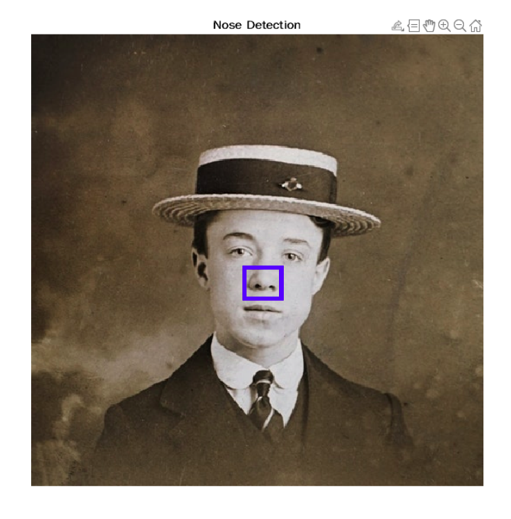
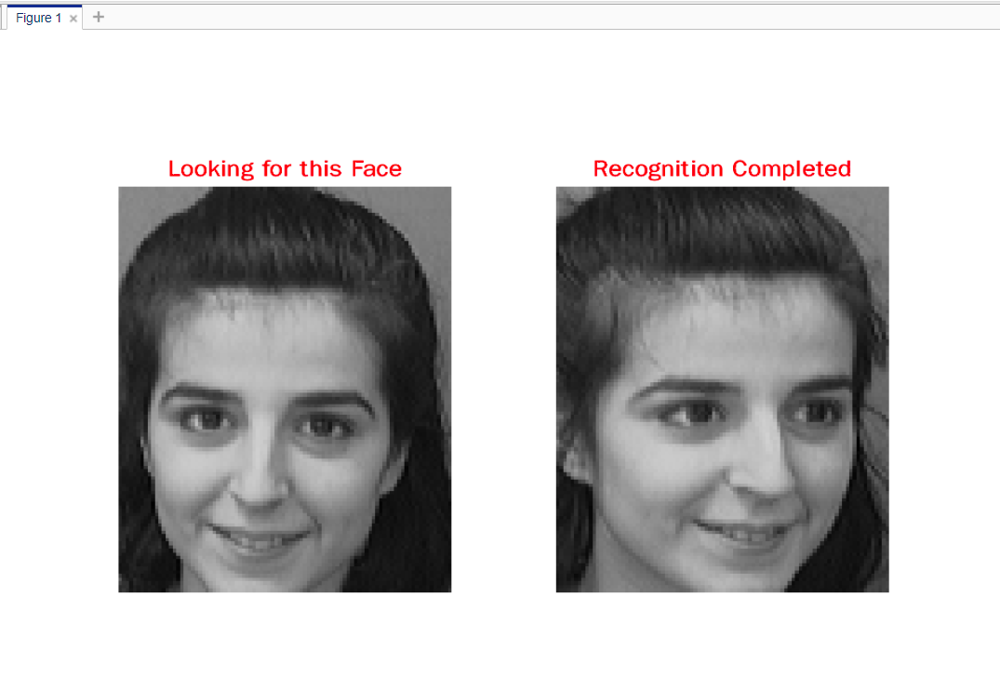

# face detection and recognition using matlab

#
#Loading the database in system

#
#Detection of face

#
#Detection of eyes

#
#Detection of mouth

#
#Detection of nose

#
#Recognition of face from database

#
#

# *Technologies used

Matlab R2022b
